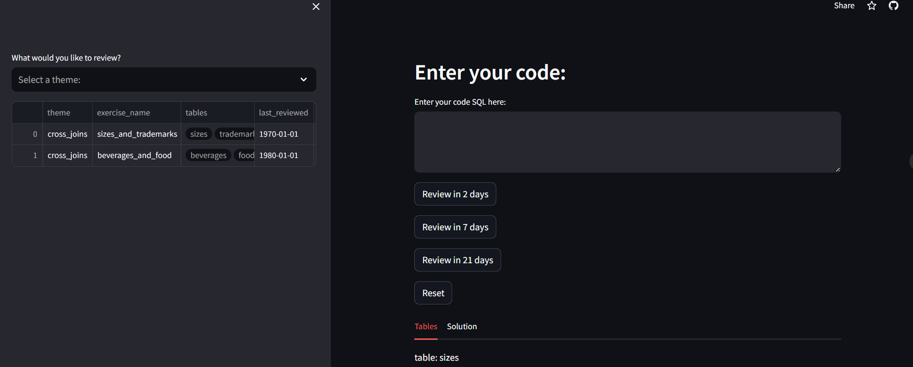

# SQL SRS (SQL Spaced Repetition System)
Streamlit app to review SQL questions.

## Application

Link to the Streamlit app : https://sql-srs-laetitia-deken.streamlit.app/

## What is SRS

Spaced Repatition System : technique for users to review previous SQL questions while they discover new ones.

## Overview

Welcome to my Streamlit Application project! 

I create a Spaced Repatition System app with Python and Streamlit to help users to review SQL modules.

## Project highlines

Here are the concepts and notions covered in this training project : 

📌 DuckDB is a Python library used in this project, which provides a rich SQL dialect, with support far beyond basic SQL. DuckDB supports arbitrary and nested correlated subqueries, window functions, collations, complex types (arrays, structs), and more ;

📌 Git / GitHub : Branch / requirements.txt file /.gitignore file / Pull Request / Merge ;

📌 Virtual Environment : venv ;

📌 Retrieve user input with st.text_area() ;

📌 requirements.txt ;

📌 Context Managers with Python ;

📌 Exceptions handling (Try / Except) ;

📌 Code Quality with Black / PyLint / iSort ;

📌 GitHub Actions : YAML file / CI with Black.

